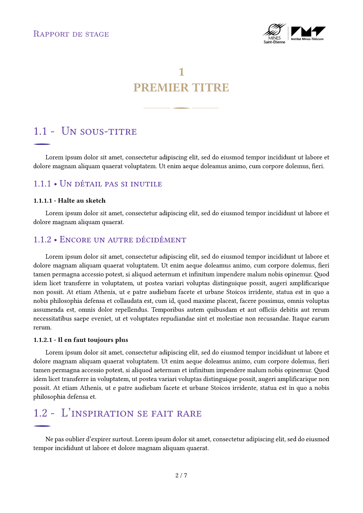

# Typst Mines de Saint-Étienne package

A Typst package for Mines Saint-Étienne's student reports.

## Usage

If you want to use it on local, make sure you have the font "New Computer Modern Sans" installed.

Define variables at the top of the template :

```typc
#let title = "Rapport de stage en entreprise sur plusieurs lignes automatiquement"
#let subtitle = "Un sous-titre pour expliquer ce titre"
#let logo = image("path/to/my-logo.png")
#let logo-horizontal = true
#let short-title = "Rapport de stage"
#let authors = ("Chloé Larroze")
#let date-start = datetime(year: 2024, month: 06, day: 05)
#let date-end = datetime(year: 2024, month: 09, day: 05)
#let despair-mode = false

#set text(lang: "fr")
```

These variables will be used for PDF metadata, default cover page and default header.


## Preview 
<div align="center" style="display: flex; flex-direction: row; justify-content: center; gap: 20px;">

  <div>
    
    <p><em>Figure 1 : Cover page preview</em></p>
  </div>

  <div>
    
    <p><em>Figure 2 : Page preview</em></p>
  </div>

</div>


